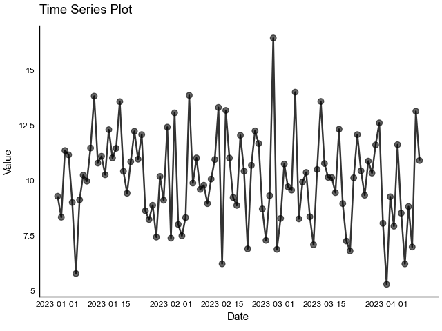
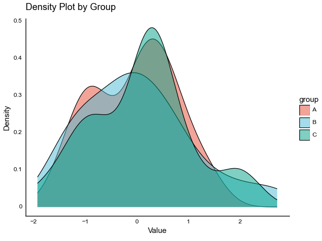
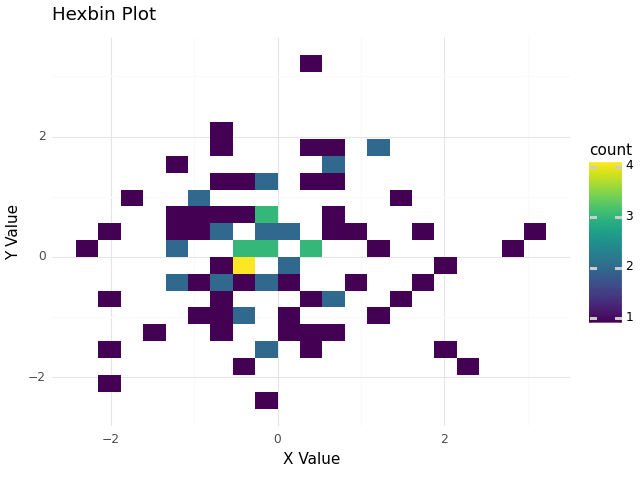
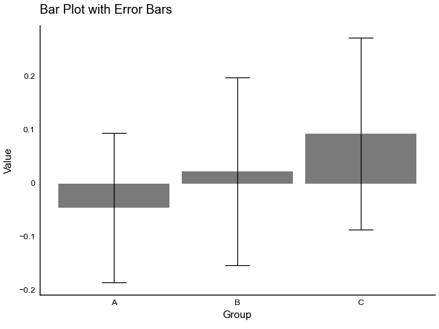

# tidyplots

A Python library for creating publication-ready plots with a fluent, chainable interface. Inspired by R's [tidyplots](https://github.com/jbengler/tidyplots) package.

## Installation

```bash
pip install tidyplots
```

## Features

- Fluent, chainable interface for creating plots
- Publication-ready plots with sensible defaults
- Comprehensive set of plot types:
  - Scatter plots
  - Line plots
  - Box plots
  - Violin plots
  - Density plots
  - Hexbin plots
  - Error bar plots
- Easy customization of colors, labels, and themes
- Statistical annotations (means, correlations, etc.)
- Built on top of plotnine for stability and compatibility

## Examples

### Time Series with Trend Line

```python
(df.tidyplot(x='date', y='value')
 .add_line(alpha=0.5)
 .add_smooth(method='loess', se=True)
 .adjust_labels(title='Time Series with Trend',
            x='Date',
            y='Value')
 .show())
```



### Scatter Plot with Groups

```python
(df.tidyplot(x='x', y='y', color='group')
 .add_scatter(alpha=0.6)
 .adjust_colors('Set2')
 .adjust_labels(title='Scatter Plot with Groups',
            x='X Value',
            y='Y Value')
 .show())
```


### Box Plot with Jittered Points

```python
(df.tidyplot(x='category', y='value', color='category')
 .add_boxplot(alpha=0.3)
 .add_data_points_jitter(width=0.2, alpha=0.5)
 .adjust_colors('Set2')
 .adjust_axis_text_angle(45)
 .adjust_labels(title='Value Distribution by Category',
            x='Category',
            y='Value')
 .show())
```


### Violin Plot with Quartiles

```python
(df.tidyplot(x='group', y='value', color='group')
 .add_violin(alpha=0.4, draw_quantiles=[0.25, 0.5, 0.75])
 .adjust_colors('Set2')
 .adjust_labels(title='Value Distribution by Group',
            x='Group',
            y='Value')
 .show())
```


### Density Plot with Multiple Groups

```python
(df.tidyplot(x='value', color='group')
 .add_density(alpha=0.3)
 .adjust_colors('Set2')
 .adjust_labels(title='Value Density by Group',
            x='Value',
            y='Density')
 .show())
```



### Hexbin Plot with Color Gradient

```python
(df.tidyplot(x='x', y='y')
 .add_hex(bins=20)
 .scale_color_gradient(low='lightblue', high='darkblue')
 .adjust_labels(title='Hexbin Plot',
            x='X Value',
            y='Y Value')
 .show())
```



### Bar Plot with Error Bars

```python
(group_stats.tidyplot(x='category', y='mean')
 .add_mean_bar(alpha=0.6)
 .add_errorbar(ymin='mean-std', ymax='mean+std')
 .adjust_colors('Set2')
 .adjust_axis_text_angle(45)
 .adjust_labels(title='Mean Value by Category',
            x='Category',
            y='Mean Value')
 .show())
```



### Scatter Plot with Trend Line and Correlation

```python
(df.tidyplot(x='x', y='y')
 .add_scatter(alpha=0.5)
 .add_smooth(method='lm')
 .add_correlation_text()
 .adjust_labels(title='Correlation Plot',
            x='X Value',
            y='Y Value')
 .show())
```


## Contributing

Contributions are welcome! Please feel free to submit a Pull Request.

## License

This project is licensed under the MIT License - see the LICENSE file for details.
