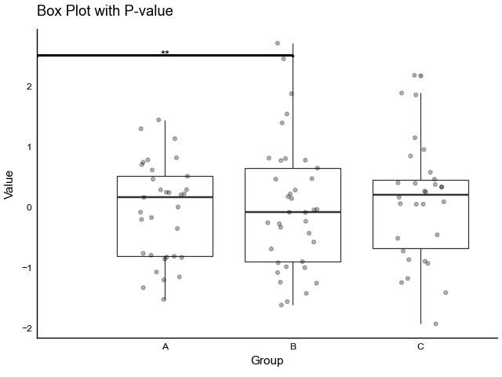
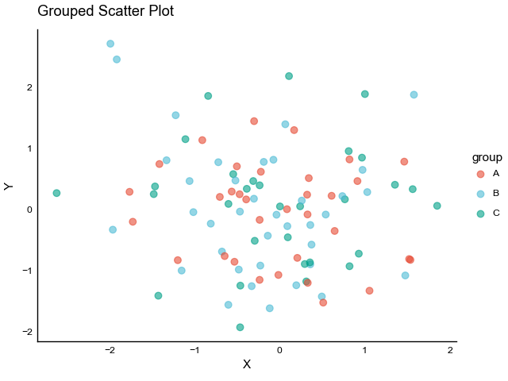
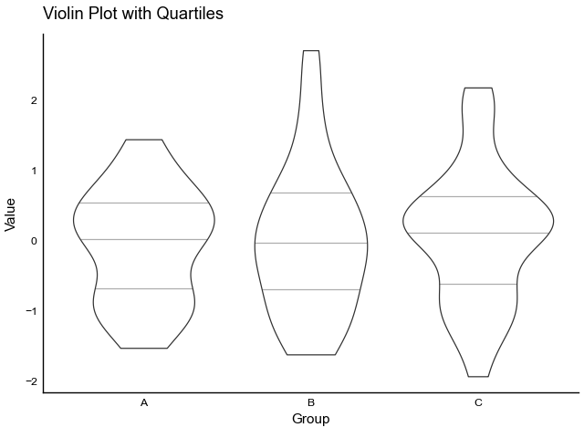
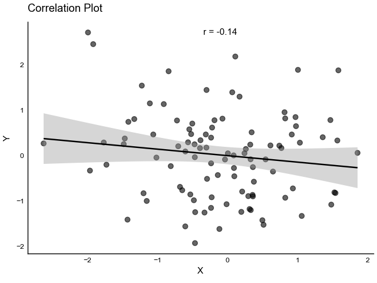

# tidyplots

A Python implementation of R's tidyplots package for creating publication-ready plots. This package provides a fluent, chainable interface for creating beautiful visualizations using plotnine (Python's ggplot2 equivalent).

## Features

- Chainable method interface for intuitive plot building
- Publication-ready plots with sensible defaults
- Comprehensive statistical visualizations
- Easy customization of colors, labels, and themes
- Built on top of plotnine (Python's ggplot2)
- Seamless integration with pandas DataFrames

## Installation

```bash
pip install tidyplots
```

## Quick Start

```python
import pandas as pd
from tidyplots import tidyplot

# Create a basic scatter plot
(tidyplot(df, x='x', y='y', color='group')
 .add_scatter()
 .adjust_labels(title='My Plot')
 .show())
```

## Core Concepts

tidyplots follows the Grammar of Graphics principles:

1. Start with data (DataFrame)
2. Map variables to aesthetics (x, y, color)
3. Add layers (geoms) for visualization
4. Customize appearance (labels, colors, themes)
5. Transform scales if needed

## Available Plot Types

### Basic Plots
- Scatter plots (`add_scatter()`)
- Line plots (`add_line()`)
- Bar plots (`add_mean_bar()`)
- Box plots (`add_boxplot()`)
- Violin plots (`add_violin()`)
- Density plots (`add_density()`)

### Statistical Plots
- Error bars (standard error, standard deviation, confidence intervals)
- Smoothed conditional means (`add_smooth()`)
- Quantile lines (`add_quantiles()`)
- Statistical test annotations (`add_test_pvalue()`, `add_correlation_text()`)

### Advanced Plots
- 2D density plots (`add_density_2d()`)
- Hexagonal binning (`add_hex()`)
- Step plots (`add_step()`)
- Ribbon plots (`add_ribbon()`)
- Rug plots (`add_rug()`)

## Examples

Here are some example visualizations using financial model comparison data:

### 1. Box Plot with Jittered Points
```python
(tidyplot(df, x='dataset', y='CGAR', color='dataset')
 .add_boxplot(alpha=0.3)
 .add_data_points_jitter(width=0.2, alpha=0.5)
 .adjust_labels(title='Compound Growth Rate by Dataset',
               x='Dataset', y='CGAR')
 .adjust_colors('Set2')
 .show())
```


### 2. Scatter Plot with Trend Line
```python
(tidyplot(df, x='volatility', y='sharp_ratio', color='dataset')
 .add_scatter(alpha=0.7)
 .add_smooth(method='lm')
 .adjust_labels(title='Sharp Ratio vs Volatility',
               x='Volatility', y='Sharp Ratio')
 .adjust_colors('Set1')
 .show())
```


### 3. Violin Plot with Data Points
```python
(tidyplot(df, x='dataset', y='total_return', color='dataset')
 .add_violin(alpha=0.4)
 .add_data_points_jitter(width=0.2, alpha=0.3)
 .adjust_labels(title='Distribution of Total Returns by Dataset',
               x='Dataset', y='Total Return')
 .adjust_colors('Set3')
 .show())
```


### 4. Error Bar Plot
```python
(tidyplot(model_stats, x='model_name', y='CGAR_mean')
 .add_errorbar(ymin='CGAR_mean - CGAR_std', 
               ymax='CGAR_mean + CGAR_std')
 .add_mean_bar(alpha=0.4)
 .adjust_labels(title='Average CGAR by Model Type (with std dev)',
               x='Model', y='CGAR')
 .adjust_axis_text_angle(45)
 .show())
```


## Gallery

Here are some example visualizations using tidyplots:

### 1. Time Series with Trend Line
```python
(tidyplot(data, x='date', y='value')
 .add_line(alpha=0.5)
 .add_smooth(method='loess', se=True)
 .adjust_labels(title='Time Series with Trend',
            x='Date',
            y='Value'))
```


### 2. Scatter Plot with Groups
```python
(tidyplot(data, x='x', y='y', color='group')
 .add_scatter(alpha=0.6)
 .adjust_colors('Blues')
 .adjust_labels(title='Scatter Plot with Groups',
            x='X Value',
            y='Y Value'))
```


### 3. Box Plot with Jittered Points
```python
(tidyplot(data, x='category', y='value', color='category')
 .add_boxplot(alpha=0.3)
 .add_data_points_jitter(width=0.2, alpha=0.5)
 .adjust_colors('Blues')
 .adjust_axis_text_angle(45)
 .adjust_labels(title='Value Distribution by Category',
            x='Category',
            y='Value'))
```


### 4. Violin Plot with Quartiles
```python
(tidyplot(data, x='group', y='value', color='group')
 .add_violin(alpha=0.4, draw_quantiles=[0.25, 0.5, 0.75])
 .adjust_colors('Blues')
 .adjust_labels(title='Value Distribution by Group',
            x='Group',
            y='Value'))
```


### 5. Density Plot with Multiple Groups
```python
(tidyplot(data, x='value', color='group')
 .add_density(alpha=0.3)
 .adjust_colors('Blues')
 .adjust_labels(title='Value Density by Group',
            x='Value',
            y='Density'))
```


### 6. Hexbin Plot with Color Gradient
```python
(tidyplot(data, x='x', y='y')
 .add_hex(bins=20)
 .scale_color_gradient(low='lightblue', high='darkblue')
 .adjust_labels(title='Hexbin Plot',
            x='X Value',
            y='Y Value'))
```


### 7. Bar Plot with Error Bars
```python
group_stats = data.groupby('category').agg({
    'value': ['mean', 'std']
}).reset_index()
group_stats.columns = ['category', 'mean', 'std']

(tidyplot(group_stats, x='category', y='mean')
 .add_mean_bar(alpha=0.6)
 .add_errorbar(ymin='mean-std', ymax='mean+std')
 .adjust_colors('Blues')
 .adjust_axis_text_angle(45)
 .adjust_labels(title='Mean Value by Category',
            x='Category',
            y='Mean Value'))
```


### 8. Scatter Plot with Trend Line and Correlation
```python
(tidyplot(data, x='x', y='y')
 .add_scatter(alpha=0.5)
 .add_smooth(method='lm')
 .add_correlation_text()
 .adjust_labels(title='Correlation Plot',
            x='X Value',
            y='Y Value'))
```


## Customization

### Colors
```python
# Change color palette
plot.adjust_colors('Set1')  # Use Set1 color palette
plot.scale_color_gradient(low='white', high='blue')  # Continuous gradient
plot.scale_color_gradient2(low='blue', mid='white', high='red')  # Diverging
```

### Labels and Text
```python
# Adjust labels
plot.adjust_labels(title='My Title', x='X Label', y='Y Label')

# Rotate axis text
plot.adjust_axis_text_angle(45)

# Control legend position
plot.adjust_legend_position('right')  # 'right', 'left', 'top', 'bottom', 'none'
```

### Scale Transformations
```python
# Transform scales
plot.scale_x_log10()  # Log10 scale for x-axis
plot.scale_y_sqrt()   # Square root scale for y-axis
plot.scale_x_reverse()  # Reverse x-axis
```

## Contributing

Contributions are welcome! Please feel free to submit a Pull Request.

## License

This project is licensed under the MIT License - see the LICENSE file for details.
